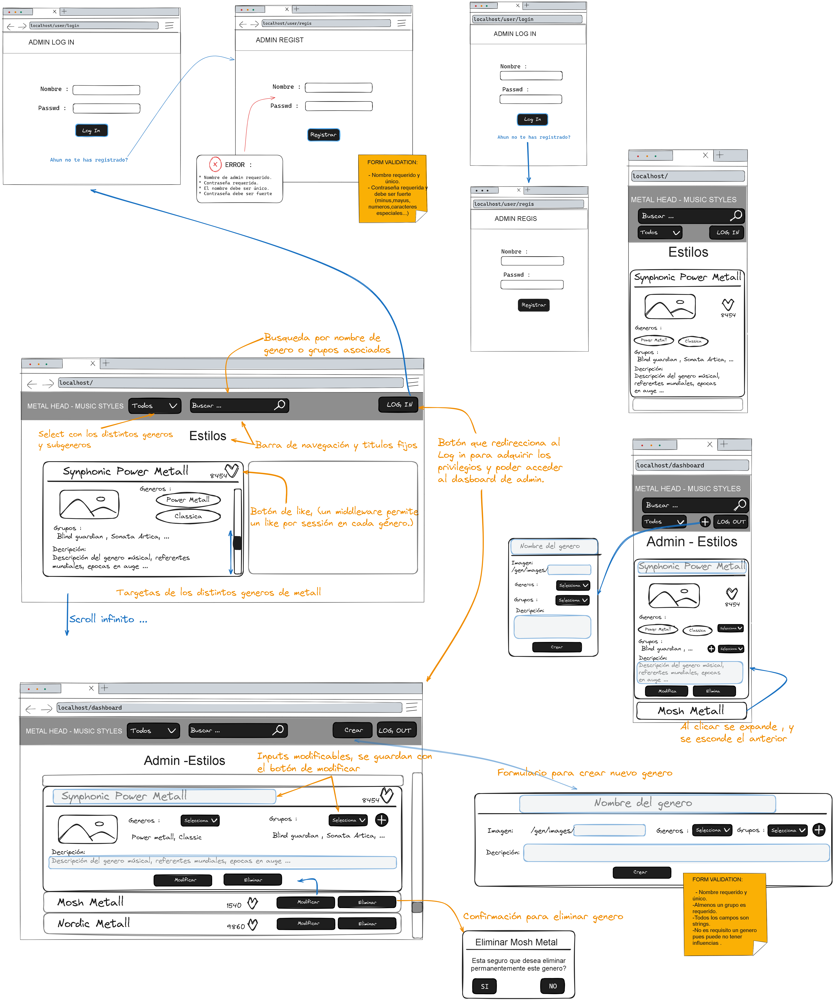

#### 1. Título

MH-MS - Metal Head Music Styles : Plataforma de gestión de estilos musicales englobados en el metal, que incluye la administración de estos junto los usuarios con privilegios y la funcionalidad de dar "Me Gusta" a los generos.

#### 2. Descripción

La aplicación permite a los usuarios ver un listado de géneros, con nombre, imagen representativa, generos influyentes, bandas relacionas y una descripción.

Se puede acotar la busqueda de un genero ya sea bien por un selector de generos (directamente) o una barra de busqueda que recoge bandas y generos. (si se esta registrado, tambien por "Me gusta")

Los usuarios autenticados pueden tener los siguientes roles:

- Usuarios: Ver sus generos favoritos.
- Administradores de contenido: Crear, editar y borrar datos de los generos.

#### 3. WIREFRAME MID-FI



#### 4. API DESIGN 

- LOG IN
    - POST /user/login {payload: (body)}
    * POST /user/regis {payload: (body)}
    + POST /user/logout {payload: (body)}

* PUBLIC VIEW (UNLOGUED)
    - GET /genres ==public==
    * GET /genres/:genreId ==public==
    + GET /genres/search ==public== {query parameters: genres (array of strings),bands (array of strings)}

* ADMIN VIEW
    - GET /dashboard ==admin==
    + GET /dashboard/:genreId ==admin==

* ADMIN ACTIONS
    - Genres
        - POST /dashboard/genres ==admin== {payload: (body)}
        * PUT /dashboard/genres/:genreId ==admin== {payload: (body)}
        + DELETE /dashboard/genres/:genreId ==admin==
    + Add Band
        - POST /dashboard/newBand ==admin== {payload: (body)}

+ USER VIEW
    - GET /users/favorites ==user==
    + PUT /users/favorites ==user== {payload: (body)}


#### 5. DISEÑO DE BASE DE DATOS

```javascript
const genreSchema = new mongoose.Schema({
    title: { type: String, required: true ,unique: true},
    likes: { type: Number, required: true },
    description: { type: String},
    genres: [{ type: mongoose.Schema.Types.ObjectId, ref: 'Genre'}]
    bands: [{ type: mongoose.Schema.Types.ObjectId, ref: 'Band', required: true }]
});

const userSchema = new mongoose.Schema({
    name: { type: String, required: true },
    password: { type: String, required: true },
    isAdmin: { type: Boolean, default: false },
    favorites: [{ type: mongoose.Schema.Types.ObjectId, ref: 'Genre' }]
});

const bandSchema = new mongoose.Schema({
    name: { type: String, required: true, unique: true }
});
```